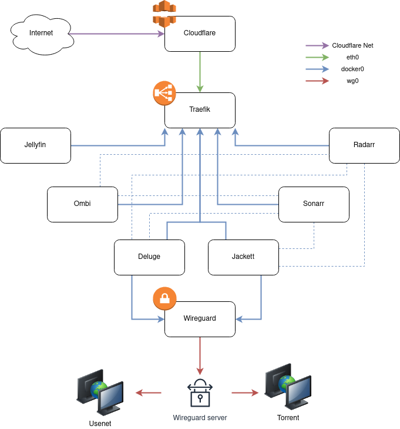

# [Mediaservarr]

Mediaservarr is a docker-and-VPN-ready mediaserver stack, or if you prefer, your DIY seedbox.
It is inspired by the work of [PARC6502](https://github.com/PARC6502/docker-media-server) and introduces some tweaks and improvements for portability and network protection.

## Containers

- Traefik - reverse proxy/load balancer
- Wireguard - VPN client
- Jellyfin - media server
- Sonnarr - tv downloader
- Radarr - movie downloader
- Ombi - requester for radarr & sonarr
- Deluge - torrent client, required for downloaders to work
- Jackett - Torrent tracker api, required for downloaders to work

## Architecture



## Requirements

- docker
- docker-compose
- A cloudflare account is recommended
- A wireguard VPN config file

## Setup

After cloning this repo...

1. Copy the example.env and give it your own variables

```bash
cp example.env .env
vim .env
```

2. Setup your DNS so that all \*.yourdomain go to the media server and put your wireguard wg0.conf file into the wireguard-config subdirectory. 

3. Fire up the docker containers

```bash
# Make sure you're running this command from inside the mediaservarr folder and that the .env file is inside the same folder
docker-compose up -d
# The command will take a bit, after it runs you can run the following to check all the containers are running
docker-compose ps
```

4. Setup all the containers

   - Deluge needs to be setup to download to `/downloads/incompleted` and move completed downloads to `/downloads/completed`. Admin password is `deluge`, change it!
   - You need to add some torrent trackers to Jackett
   - For sonarr and radarr you need to connect them to deluge and to the trackers you set up on Jackett.
      - You may also need to click add movie/add series and setup the path to be `/movies` and `/tv` respectively. Go to Settings -> Show Advanced (top bar) -> Media management. Tick "Rename movies", set "Colon Replacement" to "Replace with Space Dash Space". Tick "Create empty movie folders", tick "Delete empty folders". Click "Add Root Folder" button below and set it to `/movies` and `/tv` respectively in radarr and sonarr, if the folder doesn't appear, docker exec into radarr/sonarr container and change the ownership of the folder to the "abc" user, i.e. `chown abc /movies` and `chgrp users /movies`. Click on "Save Changes" in the topbar menu.
      - Go to Indexers -> Add indexer -> Torznab custom and add the indexers set in jackett. Remember to replace the public hostname of the jackett URL with the docker internal host, the URL should be changed from `https://jackett.mydomain.local/api/v2.0...` to `http://jackett:9117/...`. Also, provide the API key generated by jackett and press Save when done.
      - Back to radarr/sonarr settings, click on "Download Clients", add Deluge, use `deluge` as host,`8112` as port and the deluge password in the corresponding textbox.
      - You can trigger Jellyfin's library update by adding a webhook in the connect section setting as URL `http://jellyfin:8096/library/refresh?api_key=API_KEY` and `POST` as verb, you can generate an API key in the jellyfin portal settings.
   - Ombi needs to be connected to sonarr, radarr and jellyfin. You could also set up passwordless login if you're only going to be using it on your network
   - Go through the setup wizard for Jellyfin